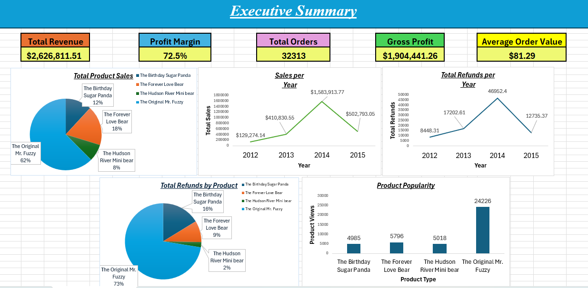
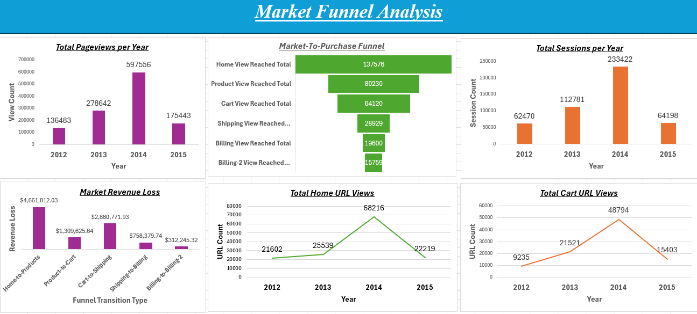

# Maven Fuzzy Toy Factory Business Analysis Project

## Project Overview
The stakeholders of Maven Fuzzy Factory, a fictional online retail platform that sells teddy
bear toys, has approached with a business problem. They want to know how they can optimize or what can be improved with the market to purchase funnel in regards to website pageviews, sessions, etc. These will in turn lead to increased sales. AI was used to review the dataset and find problems in the data and possible improvements to help develop a business problem. The original dataset can be found here: (https://mavenanalytics.io/data-playground/toy-store-e-commerce-database?utm_source=chatgpt.com)

## Business Problem

Find the three largest sources of revenue loss across the market to purchase funnel. 
Also, find how much revenue that loss amounts to and what it is as a percentage of potential revenue. 
Finally, find possible improvements and choose the improvement that would produce the greatest impact.

## Dataset 

This dataset includes data from the toy factory database. These tables include:

1. orders 
2. order_items
3. products
4. website_sessions
5. website_pageviews
6. order_item_refunds 

These tables together give a picture of the online activity, website views, sales, and refunds for the company. 

## Tools and Technology

### Tools used:

1. ChatGPT
2. Perplexity AI
3. MySQL
4. Excel

These tables were first imported into MySQL Workbench for cleaning and general EDA. Advanced analysis was then performed on the cleaned tables. Visualizations were then 
created in Excel.

## Data Preparation & Cleaning

The data was prepared and cleaned in MySQL. Empty MySQL tables were created first, and then the data was read into them. Datatypes were then inspected, nulls and blanks removed, and duplicates (if any) were removed as well. General KPIs like total orders, total revenue, and earliest and latest date records were calculated in the EDA phase. New tables with the cleaned columns were created having the "cleaned" ending in the name.

## SQL Analysis 

The Advanced SQL analysis continued in MySQL. The market-to-purchase funnel is defined as: (home -> products -> cart -> shipping -> billing -> billing-2). I create a query to count 
how many website users reached each stage of the funnel and congregated everything into one website market funnel table. I also join the cleaned versions of the pageviews, sessions, and orders tables and see which activity DID NOT result in a purchase. Since the people who initiated these website sessions and product views did not purchase anything, it is helpful to understand which products and sessions were the most popular amongst them as well. A new table is created with this information and many queries onward result from this centralized table. 

## Key Findings

FINDING 1: With a potential revenue loss of about $4,661,812.03 (if the average order value is $81.29), the biggest source of revenue loss on the market funnel comes from potential customers only visiting the home page.     

FINDING 2: The second biggest revenue loss, with about $2,860,771.93, comes from potential customers who viewed up to only the cart page.

FINDING 3: Finally, the third biggest revenue loss, with about $1,309,625.64, comes from potential customers reaching up to just the product page. 

FINDING 4: All three losses equate to a total potential revenue loss of about $8,832,209.60.

FINDING 5: The three highest losses equate to 89% of the total (losses from all funnel parts) of $9,902,834.66 potential revenue loss.

FINDING 6: The original Mr. fuzzy is by far the most popular viewed product.

FINDING 7: The original Mr. fuzzy is by far the most refunded product.

## Recommendations (find possible improvements and choose the improvement that would produce the greatest impact):

1. Get more customers to view more than just the home screen and progress further into the website funnel. Since this is where most of the revenue loss occurs, making the website more appealing or featuring popular products at the forefront would most likely lead to the greatest impact. Could the website interface be too complicated, bland, or unattractive? Is it hard to navigate? Future A/B testing with a new version of the URL could be done to test this. The total view loss percentage from home to products is about -41%. Realistically, if the company worked to increase the product view funnel count to 100000, the loss percentage would be only 27%, and the company would have kept about $1,607,156.976 in potential revenue.

2. Since the second-largest revenue loss is occurring when customers reach only up to the cart page, it could signal that customers changed their minds before actually initiating the purchase. Product pricing could influence this decision. If so, it could be helpful to examine products that may be higher priced or offer discounts for loyal customers. Maybe they had trouble uploading payment information. If so, it may be helpful to streamline the payment process. It may also be helpful to have the page generate a quick survey for why the user is navigating away from the page and not continuing with their purchase. If the company worked to increase the shipping view funnel count to 40000, the loss percentage would be only 38% (as opposed to 54%), and the company would have kept about $899,991.64 in potential revenue.

3. Since product viewing only accounts for the third potential revenue loss, it may be helpful to consider the product page structure, pricing, and how it is advertised. Are the products
presented in an accessible way? As stated previously, are they adequately priced? If the company worked to increase the cart view funnel count to 70000, the loss percentage would be only about 13% (as opposed to 20%), and the company would have kept about $478,001.16 in potential revenue.

4. Sell more of the original Mr. fuzzy. There were 29618 total views of the original Mr. fuzzy product URL page that contributed to $1934516.68 in revenue, that is about $65 dollars per view. In order to increase customer engagement, I would recommend increasing this product's views to at least 40000. This should increase the revenue garnered to $2600000 for a 34% increase in sales.

5. In terms of order refunds, the original Mr. fuzzy is by far the most refunded with a total of $61837.63 in refunds. It would also be beneficial to the company if
surveys were taken as to why that specific product was refunded so much, and what customers think should be done to improve the product. 

6. The year 2014, with $1,583,913.77 in sales, was the best year for online sales. It also has the highest session and pageview amounts as well (233,422 and 597,556 respectively). If these amounts can be set as a benchmark or milestone view count, it can be helpful for the business to attain around the same amount of revenue.

